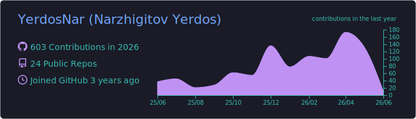

<h1> Yerdos &nbsp;&nbsp; ( &nbsp;
    &nbsp;
     &nbsp;)
</h1>

I'm **Yerdos**, a 💻 Computer Science & Engineering student living in 🇰🇷 Korea,\
interested in **low-level programming, networking, and security** \
Currently learning deeper **C, Assembly, and system-level development**.

- 🔭 I’m currently working on: Network simulation and protocol security research.
- 🌱 I’m currently learning: Reverse engineering, VPN obfuscation, and compiler design.
- 🤔 I’m looking for help with: Efficient C-based implementations for network protocols.
- 📫 How to reach me: [EMail](mailto:besway2000@gmail.com) | [LinkedIn](https://www.linkedin.com/in/YerdosNar) | [GitHub](https://github.com/YerdosNar) | [IG](https://instagram.com/uvenni)\
╔═════════════════╗\
║Try `curl linm-m.com` ║\
╚═════════════════╝
<!-- - ⚡ Fun fact: I box professionally and code all night. 🥊💻 -->
---

    <h3 align="center">Stacks</h3>
    
    
    
    
    
    
    
    

---
<h3 align="center">📊 My GitHub Overview</h3>

    
    

    
    

### 📦 My Open Source Projects

<a href="https://github.com/YerdosNar#gh-dark-mode-only">
    <table style="border: solid; border-radius: 10px"><thead align=center><tr border: none;><td><b>🎁 Projects</b></td><td><b>⭐ Stars</b></td><td><b>📚 Forks</b></td><td><b>🛎 Issues</b></td><td><b>📬 Pull requests</b></td><td><b>💡 Last Commit</b></td></tr></thead><tbody>
        <tr><td><a href="https://github.com/YerdosNar/digitNN"><b>digitNN</b></a></td><td></td><td></td><td></td><td></td><td></td></tr>
        <tr><td><a href="https://github.com/YerdosNar/3x-ui-auto"><b>3x-ui-auto</b></a></td><td></td><td></td><td></td><td></td><td></td></tr>
        <tr><td><a href="https://github.com/YerdosNar/png"><b>png</b></a></td><td></td><td></td><td></td><td></td><td></td></tr>
        <tr><td><a href="https://github.com/YerdosNar/Profile"><b>Profile</b></a></td><td></td><td></td><td></td><td></td><td></td></tr>
        <tr><td><a href="https://github.com/YerdosNar/P2PMessaging"><b>P2PMessaging</b></a></td><td></td><td></td><td></td><td></td><td></td></tr>
    </tbody></table>
</a>

---

This <i>README</i> refreshes every few hours automatically. Last updated: 2026-01-26

    

